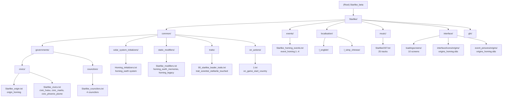

# CLAUDE.md

This file provides guidance to Claude Code (claude.ai/code) when working with code in this repository.

## Project Overview

Starlike: Project Homing (偌星：归巢计划) is a **Stellaris v4.3 game mod** that adds:
- Original soundtrack (25 tracks by Arnaud Roy and H-Pi)
- Custom origin: "Project Homing" (origin_homing) — locked to the "homing_earth" solar system
- Three faction civics: Huisu (civic_huisu), Martis (civic_martis), Phoenix Plume (civic_phoenix_plume)
- Four councilors: Ruler of COPAN + Huisu/Martis/Phoenix Plume faction councilors
- Custom event chain via `event_homing.*` namespace (4 events)
- Custom modifiers, leader traits, and council agendas

The mod does not use traditional programming languages — it is built entirely with **Paradox Scripting Language** (declarative `.txt` files) loaded by the Stellaris engine.

## Tech Stack

- **Game engine**: Paradox Interactive Stellaris v4.3
- **Modding language**: Paradox Scripting Language (P-language) — `.txt` files
- **Localization**: YAML (`.yml`) — one file per language under `localisation/`
- **Graphics**: DDS textures (`.dds`), `.gfx` definition files
- **Audio**: OGG Vorbis music tracks (25 tracks, fully present)
- **IDE**: JetBrains IntelliJ IDEA (configured in `.idea/`)
- **Version control**: Git

There is **no build/test pipeline**. The mod is loaded directly by the Stellaris engine. To verify changes, launch the game with the mod enabled.

---

## Changelog

### 2026-03-26 (v0.2.0) — Faction Civic & Councilor Rewrite

- **origin_homing**: Removed auth_copan binding; now independent origin compatible with vanilla auth_dictatorial
- **New civics**: `civic_huisu` (Huisu Faction), `civic_martis` (Martis Faction), `civic_phoenix_plume` (Phoenix Plume Faction)
- **New councilors**: `councilor_huisu`, `councilor_martis`, `councilor_phoenix_plume` (faction-linked)
- **New events**: event_homing.1-.4 (Europa colonization + StarDust Earth exploration chain)
- **New traits**: `trait_scientist_stellarite_touched`
- **New modifiers**: `homing_earth_memories`, `homing_legacy`

### 2026-03-26 (v0.2.1) — Documentation & Scan

- Full module documentation scan completed
- All 10 modules documented with CLAUDE.md files

---

## Module Structure



## Module Index

| Module | Path | Language | Entry File | Description |
|--------|------|----------|------------|-------------|
| governments/civics | `common/governments/civics/` | P-language | `Starlike_origin.txt`, `Starlike_civics.txt` | origin_homing + 3 faction civics |
| governments/councilors | `common/governments/councilors/` | P-language | `Starlike_councilors.txt` | 4 COPAN councilors |
| solar_system_initializers | `common/solar_system_initializers/` | P-language | `Homing_initializers.txt` | homing_earth system (Sol-like) |
| static_modifiers | `common/static_modifiers/` | P-language | `Starlike_modifiers.txt` | 2 custom modifiers |
| traits | `common/traits/` | P-language | `00_starlike_leader_traits.txt` | 1 leader trait |
| on_actions | `common/on_actions/` | P-language | `1.txt` | on_game_start_country hook |
| events | `events/` | P-language | `Starlike_homing_events.txt` | 4-event chain (namespace: event_homing) |
| localisation | `localisation/` | YAML | `Starlike_l_english.yml`, `Starlike_l_simp_chinese.yml` | Full EN+CN localization |
| music | `music/` | P-language | `StarlikeOST.txt` | 25-track soundtrack (2 composers) |
| interface | `interface/` | P-language | `Originpictures.gfx` | Origin picture sprite |
| gfx | `gfx/` | Binary DDS | (textures only) | 10 loading screens + 2 origin assets |

## Running & Development

### Testing changes
Launch Stellaris with the mod enabled. Paradox scripts are hot-reloaded in the launcher (Paradox Mod System).

For event chains, trigger manually via console:
```
event event_homing.1
```

For debug, check logs at:
```
Documents/Paradox Interactive/Stellaris/logs/error.log
```

### File loading order
Stellaris loads files in **lexical order** within each `common/` subdirectory. Prefix mod files with `Starlike_` or numbers (`00_`, `1.txt`) to ensure they load after vanilla equivalents.

### Key namespaces
- `event_homing.*` — All custom events
- `homing_*` — Solar system initializers, modifiers
- `trait_scientist_*` — Leader traits

## Paradox Scripting Patterns

### File naming
- Use `Starlike_*.txt` to ensure mod content loads after vanilla equivalents.
- All new definition types must be prefixed with the mod namespace to avoid collision (e.g., `origin_homing`, `event_homing.*`).

### Common block types
```pdx
# Origin (starting condition)
origin_homing = {
    is_origin = yes
    icon = "gfx/interface/icons/origins/origins_homing.dds"
    initializers = { homing_earth }
    modifier = { ... }
}

# Civic (faction civic)
civic_huisu = {
    description = "civic_huisu_effects"
    possible = { origin = { value = origin_homing } }
    modifier = { ... }
}

# Councilor (faction-linked)
councilor_martis = {
    leader_class = { scientist }
    possible = { origin = { value = origin_homing } }
    civic = civic_martis
    modifier = { ... }
}

# Solar system initializer
homing_earth = {
    class = "sc_g"
    usage = origin
    flags = { Homing_Sol }
    planet = { ... }
}

# Event (namespace required at top of file)
namespace = event_homing
country_event = {
    id = event_homing.1
    is_triggered_only = yes
    immediate = { ... }
}
```

### Localization workflow
1. Add the key to both `localisation/l_english/Starlike_l_english.yml` and `localisation/l_simp_chinese/Starlike_l_simp_chinese.yml`.
2. Reference keys in script with quoted string: `description = "civic_huisu_effects"`.
3. Stellaris parses the YAML key after the colon as the value — no quotes needed in YAML values unless they contain special characters.
4. Chinese text supports Stellaris color codes: `§g...§!`, `§H...§!`, `§R...§!`, `£mod_...£`.

### Graphics (.gfx files)
- `interface/Originpictures.gfx` — defines `spriteType` entries mapping GFX constants to texture files.
- Texture paths are relative to the mod root: `gfx/event_pictures/origins/origins_homing.dds`.
- New portrait/icon assets go under `gfx/` with corresponding `.gfx` sprite definitions.

## Common Development Tasks

### Adding a new civic
1. Create entry in `common/governments/civics/Starlike_civics.txt`.
2. Add localization keys for the new civic in both YAML files.
3. Reference in `councilor_*` via `civic = civic_xxx`.

### Adding a new event chain
1. Choose a namespace: `namespace = event_homing` (extend existing) or create a new one.
2. Define `country_event`, `planet_event`, or `galactic_community_event` blocks.
3. Add `id = namespace.N` where N is a unique integer.
4. Trigger via `events = { namespace.N }` in on_actions, decisions, or other events.
5. Add localization for `namespace.N.title`, `namespace.N.desc`, and any option strings.

### Adding music tracks
1. Place `.ogg` files under `music/`.
2. Uncomment and update the `file =` line in `music/StarlikeOST.txt`:
   ```pdx
   song = { name = "Track_Name" }
   file = "path/to/track.ogg"
   ```

### Adding a council agenda
1. Define in `common/council_agendas/Starlike_council_agendas.txt`.
2. Use `potential = { origin = { value = origin_homing } }` for origin-based locking (preferred over authority-based).
3. Add localization keys in both YAML files.

## Reference Documentation

The `代码参考（必看）/` directory contains 60+ tutorial folders covering every aspect of Paradox modding. Key references:
- `P语言教程.txt` — P-language syntax tutorial
- `群星数值注释.txt` — Game balance values reference
- `群星common文件夹下的文件的作用.txt` — `common/` directory structure guide
- `国策和配套的领袖编写/` — Civic and councilor reference
- `传统和议程的编写/` — Tradition and council agenda reference
- `起源编写/` — Origin reference
- `政体的编写/` — Authority reference

## Known Issues & Gaps

### RESOLVED

- **Naming mismatch (civic_yinghuo/councilor_yinghuo vs civic_martis/councilor_martis)** — Fixed 2026-03-26. English YAML `civic_yinghuo_*` keys renamed to `civic_martis_*`; `councilor_yinghuo` renamed to `councilor_martis` (keys + display). TXT `civic_Martis` (uppercase M) fixed to `civic_martis`. All keys now align: txt definition `civic_martis` → `councilor_martis` → EN YAML `councilor_martis_*` → CN YAML `councilor_martis_*`.

### Medium Priority

- **No species/portrait**: Starting species not yet defined (needs `common/species/` + `gfx/portraits/`).
- **No council_agendas**: Faction-specific council agendas not yet implemented.

### Low Priority

- **Music paths commented**: All `file =` lines in `StarlikeOST.txt` are commented out; uncomment once audio files are placed.
- **No ship designs**: Default starting ship designs not defined.
- **No name lists**: Species name lists for Homing species not defined.
- **No ascension perks**: "Alpenglow" ascension perk mentioned in README but not yet implemented.
